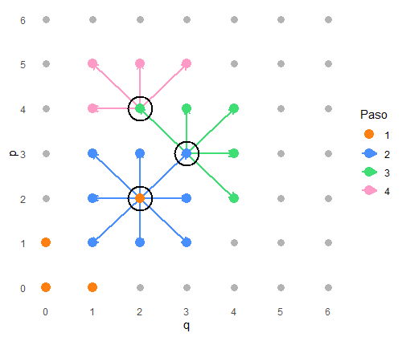
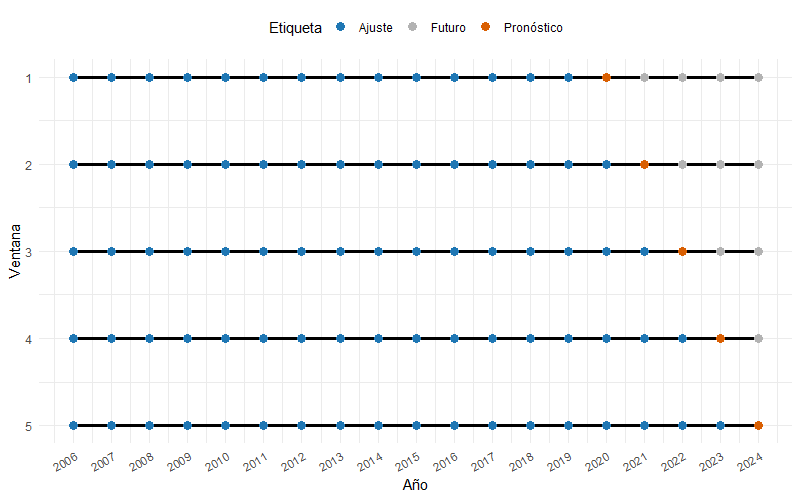

---
format:
  pdf:
    papersize: A4
    title-page: false
    include-before-body: caratula.tex 
    include-in-header: preamble.tex
    indent: true
    number-sections: TRUE
    geometry:
      - top=25mm
      - left=25mm
      - right=25mm
      - bottom=25mm
      - heightrounded
    fontsize: 12pt
mainfont: Calibri
lang: es
fig-pos: H
message: false
warning: false
echo: false
header-includes:
  - \usepackage{setspace}
  - \setlength{\parskip}{0.6em}
  - \onehalfspacing
---

\section*{Agradecimientos}

\setlength{\parindent}{0pt}

\setlength{\parindent}{1.5em}

\newpage

\section*{Resumen}

Esta tesina investiga estrategias para la modelización y pronóstico de series temporales interrumpidas, tomando como caso de estudio el flujo de pasajeros del Transporte Urbano de Rosario afectado por la pandemia de COVID-19. Ante un shock de tal magnitud, los modelos estadísticos tradicionales enfrentan dificultades para capturar cambios estructurales abruptos. El trabajo evalúa y compara el desempeño de modelos ARIMA, modelos de suavizamiento exponencial (ETS), métodos de intervención y enfoques contrafactuales, además de proponer una combinación de pronósticos (Ensemble).

Los resultados indican que, durante el periodo de recuperación (2021-2022), los modelos altamente adaptativos (ETS) y el método Ensemble superaron significativamente a las estructuras rígidas de ARIMA, demostrando menores errores de predicción en términos de RMSE y MAE. Se concluye que, ante eventos disruptivos, la capacidad de ajuste local y la adaptabilidad de los modelos son criterios más determinantes para la precisión del pronóstico que el cumplimiento estricto de los supuestos clásicos de ruido blanco. Estos hallazgos proporcionan una herramienta valiosa para la gestión pública y la planificación del transporte en contextos de incertidumbre, permitiendo al Ente de la Movilidad de Rosario realizar proyecciones más robustas, resilientes y ajustadas a la dinámica social de la ciudad.

\setlength{\parindent}{0pt}

**Palabras claves**: Series Temporales, Interrupción, Transporte Urbano, COVID-19 

\setlength{\parindent}{1.5em}

\newpage

# Introducción

El análisis y pronóstico de series temporales constituyen herramientas fundamentales en diversas áreas aplicadas -como economía, salud, movilidad, transporte, energía, educación y políticas públicas- debido a su capacidad para describir la evolución de los fenómenos y anticipar escenarios futuros. Sin embargo, los métodos tradicionales suelen basarse en el supuesto de estabilidad de los patrones históricos y de continuidad estructural. Este supuesto puede resultar problemático cuando las series se ven afectadas por eventos disruptivos que alteran la regularidad de su comportamiento.

Los *shocks* exógenos -tales como pandemias, reformas regulatorias, cambios en los comportamientos sociales, interrupciones en infraestructuras o eventos extraordinarios- generan alteraciones significativas en las series temporales. En muchos casos, estos eventos se manifiestan a través de quiebres de nivel, cambios en la tendencia y la estacionalidad, observaciones atípicas extremas y procesos de recuperación no lineales. La irrupción simultánea de alguno de estos fenómenos desafía los supuestos y la capacidad de adaptación de la mayoría de los modelos clásicos, dificultando la obtención de pronósticos precisos, especialmente cuando se busca comprender el comportamiento inmediato posterior a la disrupción y la trayectoria de recuperación.

Un caso particularmente relevante, tanto en Argentina como a nivel mundial, es la pandemia de COVID-19. Durante el año 2020, esta produjo una alteración abrupta en las series de movilidad y transporte urbano: el volumen de pasajeros transportados cayó a mínimos históricos debido a las restricciones de circulación, seguido de una recuperación lenta y heterogénea a medida que las restricciones se fueron flexibilizando. Estas características convierten a las series de transporte y movilidad en un contexto adecuado para el análisis de metodologías robustas para el tratamiento de series temporalmente interrumpidas.

Recientemente, Hyndman y Rostami-Tabar (2024) han sistematizado diversas estrategias para el tratamiento y pronóstico de series interrumpidas, incluyendo modelos altamente adaptativos, modelos de intervención, métodos contrafactuales y combinaciones (*ensembles*), planteando un marco conceptual que resulta particularmente relevante para series afectadas por *shocks* como los observados en el transporte urbano durante la pandemia.

En este contexto, la presente tesina propone evaluar y comparar distintas metodologías de pronóstico para series interrumpidas, aplicándolas específicamente a la serie mensual de pasajeros del Transporte Urbano de Pasajeros (TUP) de la ciudad de Rosario, con el objetivo de analizar el desempeño de las distintas estrategias durante el período disruptivo y en la etapa posterior.

\newpage

# Objetivos

## Objetivo general

Evaluar, de manera comparativa, distintas metodologías de pronóstico aplicables a series temporales univariadas interrumpidas, mediante su aplicación a la serie de pasajeros del transporte urbano de Rosario, con el fin de analizar su desempeño predictivo en distintos momentos del ciclo disruptivo.

## Objetivos específicos

\setlength{\parindent}{0pt}

- Realizar un análisis descriptivo detallado de la serie, identificando el período de interrupción y sus efectos sobre la tendencia y estacionalidad.

- Ajustar modelos ARIMA y SARIMA como línea de base, evaluando su estabilidad en presencia de eventos disruptivos.

- Implementar modelos altamente adaptativos (ETS) y analizar su capacidad de ajuste durante la disrupción.

- Ajustar modelos de intervención (regresión con errores ARIMA), incorporando variables explicativas que representen el evento disruptivo.

- Implementar modelos contrafactuales:

  - Marcando el período disruptivo como faltante ("*set to missing*").
  
  - Reconstrucción del período mediante estimaciones de lo que podría haber sido ("*what might have been*").

- Explorar combinaciones de modelos (*ensembles*) y evaluar su impacto en el desempeño predictivo.

- Comparar todas las estrategias mediante métricas puntuales y probabilísticas (RMSE, MAE, MAPE y *Winkler Score*).

- Elaborar recomendaciones metodológicas para el uso de estas estrategias en series temporales afectadas por disrupciones similares.

\newpage

# Metodología

\setlength{\parindent}{1.5em}

En esta sección se presentan diversas estrategias para manejar interrupciones en el pronóstico de series temporales. El tratamiento de interrupciones en series de tiempo constituye un problema complejo y multifacético, y la elección de la estrategia más adecuada depende de las características específicas de los datos y de la naturaleza de la interrupción. Por esta razón, en la presente tesina se adoptan múltiples estrategias en lugar de un único enfoque, con el fin de abordar de manera efectiva distintas situaciones y casos.

## Conceptos básicos de series de tiempo

Una serie de tiempo es una secuencia de observaciones ordenadas de una variable objetivo a lo largo del tiempo en intervalos regulares (cada día, cada mes, cada año, etc.). La naturaleza intrínseca de las series temporales es que sus observaciones son dependientes o correlacionadas, y por lo tanto, el orden de las observaciones es importante. Por esta razón, los procedimientos basados en el supuesto de independencia no resultan aplicables, lo que requiere el uso de metodologías específicas para series temporales. 

Formalmente, un proceso estocástico es un conjunto de variables aleatorias ${y_t}$ donde el índice $t$ toma valores en un cierto conjunto $C$. En nuestro caso, este conjunto es ordenado y corresponde a los instantes temporales (días, meses, años, etc.). Para cada valor $t$ del conjunto $C$, es decir, para cada instante temporal, está definida una variable aleatoria $y_t$, y los valores observados de las variables aleatorias en distintos instantes forman una serie temporal. Por lo tanto, una serie de tiempo de $T$ datos, $(y_1, y_2, ..., y_T)$, es una muestra de tamaño uno del vector de $T$ variables aleatorias ordenadas en el tiempo correspondientes a los momentos $t = 1,...,T$, y la serie observada se considera una realización del proceso estocástico. 

En el análisis de series temporales resulta esencial identificar los patrones que influyen en su comportamiento a lo largo del tiempo, ya que estos permiten comprender la dinámica de los datos y facilitan su adecuada modelización. Entre los principales componentes que pueden observarse en una serie temporal se destacan la tendencia, la estacionalidad, el componente cíclico y el componente aleatorio, los cuales se describen a continuación.

- Tendencia: esta componente refleja un crecimiento o decrecimiento en la serie a través del tiempo, no tiene que ser necesariamente lineal. A veces se refiere a la tendencia como un cambio de dirección, cuando se pasa de una tendencia creciente a una decreciente.

- Estacionalidad: es el comportamiento repetitivo de la serie en un período corto y conocido, esta componente está afectada por factores estacionales tales como el momento del año o el día de la semana entre otros.

- Ciclo: corresponde a oscilaciones de largo plazo que se manifiestan en torno a la tendencia, sin una periodicidad fija, y cuya duración suele extenderse por un período no inferior a dos años.

- Aleatorio: comprende las variaciones irregulares de la serie que no pueden ser atribuidas a la tendencia, la estacionalidad ni al componente cíclico. Dichas fluctuaciones responden, en general, a perturbaciones imprevisibles o a la influencia de factores externos no sistemáticos.  

En el análisis de series temporales, es importante determinar si una serie es estacionaria o no lo es. Diremos que una serie es estacionaria en sentido débil si, para todo $t$:

1. $E(y_t) = \mu_t = \mu = cte$ \hfill (1)
2. $Var(y_t) = \sigma_t^2 = \sigma^2 = cte$ \hfill (2) 
3. $Cov(y_t, y_{t-k}) = \gamma_k \ \ \ \ \ k = 0, \pm 1, \pm 2$ \hfill (3)

\setcounter{equation}{3}

Las dos primeras condiciones indican que la media y la varianza son constantes. La tercera, que la covarianza entre dos variables depende sólo de su separación. 

Por otro lado, diremos que una serie es no estacionaria si la media, la varianza y la covarianza no son constantes a través del tiempo. Una forma de solucionar la no estacionariedad en media es tomando una cantidad adecuada de diferencias de la serie, es decir, si la serie $\{y_t\}$ es no estacionaria y tomamos una cantidad $d$ de diferencias se obtiene una nueva serie $\{(1-B)^dy_t\}$ para algún entero $d \geq 1$, que es estacionaria. Para determinar cuantas diferenciaciones hay que realizarle a la serie se puede realizar por inspección de algún gráfico de la función de autocorrelación o bien realizar alguna prueba de hipótesis, como por ejemplo, el test de Kwiatkowski-Phillips-Schmidt-Shin (KPSS). El cual se emplea para verificar la hipótesis nula de que la serie es estacionaria. Por consiguiente, un p-valor inferior al nivel de significación adoptado (comúnmente 0,05) proporciona evidencia estadística para rechazar dicha hipótesis, indicando la necesidad de aplicar una o más diferenciaciones para estabilizar la media.

Sin embargo, un proceso puede ser estacionario en media pero no en varianza y covarianza. Por lo tanto, para corregir este problema es necesario aplicar las transformaciones de Box-Cox a la variable objetivo, definida como:

$$T(y_t) = \left\{\begin{matrix}
\frac{y_t^{\lambda} - 1}{\lambda} \ si \ \lambda \neq 0 \\ ln(y_t) \ si \ \lambda = 0
\end{matrix}\right.$${#eq-boxcox}

### Autocorrelación

La autocorrelación es una medida de asociación que mide la correlación entre una serie temporal y la misma serie en diferentes momentos. Es una herramienta fundamental en el análisis de series ya que permite detectar no aleatoriedad, identificar dependencias temporales y validar modelos de series temporales (por ejemplo, $AR$, $ARMA$, entre otros).

#### Función de Autocorrelación

La Función de Autocorrelación (ACF, por sus siglas en inglés) constituye una herramienta fundamental en el análisis de series temporales, ya que permite cuantificar el grado de asociación lineal entre los valores de la serie y sus propios valores pasados a distintos rezagos. Formalmente, la autocorrelación correspondiente a un rezago $k$ se define mediante la siguiente expresión:

$$\rho_k = \frac{Cov(y_t, y_{t+k})}{\sqrt{Var(y_t)}\sqrt{Var(y_{t+k})}} = \frac{\gamma_k}{\gamma_0}$${#eq-autocor}

\setlength{\parindent}{0pt}

donde $\rho_k$ es el coeficiente de autocorrelación para el rezago $k$, $y_t$ y $y_{t+k}$ son los valores de la serie en los tiempos $t$ y $t+k$ respectivamente y notar que $Var(y_{t}) = Var(y_{t+k}) = \gamma_0$.

\setlength{\parindent}{1.5em}

El coeficiente $\rho_k$ varía de -1 a 1. Si $\rho_k$ esta cerca de 1 indica que los valores de la serie están altamente correlacionados con los valores rezagados en $k$ momentos. Si $\rho_k$ está cerca de -1 indica que los valores de la serie están altamente correlacionados de forma negativa con los valores rezagados en $k$ momentos. Por último, si $\rho_k$ está cerca de 0 indica que no hay una correlación significativa entre los valores de la serie para ese rezago.

#### Función de Autocorrelación Parcial

La Función de Autocorrelación Parcial (PACF, por sus siglas en inglés) es una herramienta clave en el análisis de series temporales que permite medir la relación lineal directa entre una observación y su valor rezagado $k$, eliminando previamente el efecto de los rezagos intermedios $1, 2, ..., k-1$. A diferencia de la Función de Autocorrelación (ACF), que capta tanto efectos directos como indirectos entre los valores de la serie, la PACF aísla exclusivamente la contribución propia de cada rezago. La expresión de la autocorrelación parcial correspondiente al rezago $k$ resulta:

$$\phi_{kk} = Corr(y_t, y_{t+k}|y_{t+1}, y_{t+2},...,y_{y+k-1})$${#eq-pacf}

Esta función resulta especialmente útil en la etapa de identificación de modelos autorregresivos dentro de la metodología de Box-Jenkins, ya que un corte claro en la PACF suele indicar el posible orden $p$ de un modelo $AR(p)$.


### Pronósticos

Unos de los objetivos primordiales del análisis de series temporales es realizar pronósticos tanto puntuales como por intervalos de predicción de la variable en estudio haciendo uso de los modelos propuestos. Formalmente, los pronósticos puntuales a un horizonte $l$ con $l > 0$, se obtienen como:

$$\hat{y}_{T+l|T} = E(y_{n+l}|y_n,y_{n-1},...)$${#eq-pron}

Se podria hablar de intervalos de predicción haciendo el supuesto de distribución normal y/o los intervalos de predicción a partir de distribuciones simuladas de la variable respuesta.

### Limitaciones en la modelización de series temporales

Una de las potenciales limitaciones que puede afectar a la modelización de series temporales son las observaciones extremas, también conocidas como *outliers*, se la define como aquellas observaciones que se alejan del patrón regular de los datos, es decir que sobresalen notoriamente del resto de las observaciones. Muchas veces es común no tenerlos en cuenta en la modelización de la serie porque pueden afectar seriamente los resultados del análisis, pudiendo sugerir modelos no apropiados y de esa forma alterar los pronósticos, este no es el caso dado que si eliminamos del conjunto de datos aquellas observaciones se elimina información vital para el entendimiento de cuando ocurre el evento disruptivo y su posterior recuperación.


## ARIMA/SARIMA

Los modelos ARIMA (*AutoRegressive Integrated Moving Average*) representan uno de los enfoques más utilizados y consolidados para el análisis y pronóstico de series temporales univariadas. Estos están compuestos por tres componentes esenciales: la parte autorregresiva (AR), el término integrado o de diferenciación (I) y la parte promedio móvil (MA). El modelo general se expresa como: 

$$\phi_p(B) \nabla^d y_t = \theta_q(B) \varepsilon_t$${#eq-arima}

\setlength{\parindent}{0pt}

donde $y_t$ representa el valor observado, $\phi_p(B) = (1- \phi_1B - \cdots - \phi_pB^p)$ es el operador AR regular de orden p, $\nabla^d = (1-B)^d$ representa las diferencias regulares y $\theta_q(B) = (1 - \theta_1B - \cdots - \theta_qB^q)$ es el operador promedio móvil regular de orden q. Adicionalmente, se asume que el término de error $\varepsilon_t$ constituye un proceso ruido blanco Gausseano, es decir, $\varepsilon_t \underset{iid}{\sim} \mathcal{N}(0, \sigma^2_{\varepsilon})$.

\setlength{\parindent}{1.5em}

La componente autorregresiva modela la dependencia entre el valor actual de la serie y sus valores pasados, por lo que un proceso autorregresivo de orden $p$ puede escribirse como:

$$\phi_p(B) y_t = \varepsilon_t$${#eq-ar}

Este enfoque es análogo a una regresión lineal múltiple, con la particularidad de que los predictores corresponden a valores rezagados de $y_t$. Este enfoque se denomina modelo autorregresivo $AR(p)$, que se formula, en general, para series estacionarias y exige determinadas restricciones sobre sus parámetros. Por definición, un proceso $AR(p)$ es siempre invertible, pero para que sea estacionario es necesario que las raíces de $\phi_p(B) = 0$ caigan fuera del círculo unitario.

\newpage

La componente promedio móvil refleja la dependencia entre el valor actual de la serie y los errores de pronósticos previos, por lo que un proceso promedio móvil de orden $q$ se lo puede escribir como:

$$y_t = \theta_q(B)\varepsilon_t$${#eq-ma}

Por definición se tiene que este proceso es siempre estacionario, pero para que sea invertible es necesario que las raíces de $\theta_q(B) = 0$ caigan fuera del cículo unitario.

Así, la incorporación conjunta de estas componentes y la utilización de un orden apropiado de diferenciación en la parte regular permiten capturar estructuras sistemáticas complejas, con el propósito de obtener un ajuste adecuado del modelo.

Sin embargo, los modelos ARIMA no incorporan la estacionalidad de manera explícita, es por ello que, para series con estacionalidad marcada, como ocurre con series mensuales o trimestrales, se emplean los modelos SARIMA:

$$\Phi_P(B^s) \phi_p(B) \nabla_s^D \nabla^d y_t = \theta_q(B) \Theta_Q(B^s) \varepsilon_t$${#eq-sarima}

\setlength{\parindent}{0pt}

donde $y_t$ representa el valor observado, $\Phi_P(B^s) = (1- \Phi_1B^s - \cdots - \Phi_PB^{sP})$ es el operador AR estacional de orden P, $\nabla_s^D = (1-B^s)^D$ representa las diferencias estacionales, $\Theta_Q(B^s) = (1 - \Theta_1B^s - \cdots - \Theta_QB^{sQ})$ es el operador promedio móvil estacional de orden Q y $\varepsilon_t$ es un proceso ruido blanco Gausseano.

\setlength{\parindent}{1.5em}


Con el objetivo de seleccionar la especificación más adecuada, se utilizará la función `ARIMA()` del paquete `fable`, que permite realizar una selección automática del mejor modelo basándose en el algoritmo de Hyndman-Khandakar. 

Dicho algoritmo implementa un procedimiento automatizado para la identificación del modelo ARIMA más adecuado. En primer lugar, evalúa la necesidad de diferenciación mediante la aplicación de tests de raíz unitaria, tales como el test de KPSS.

Posteriormente, el algoritmo realiza una búsqueda en el espacio de posibles modelos, combinando distintos órdenes de las componentes autorregresivas y de promedio móvil, tanto regulares como estacionales. Esta exploración se lleva a cabo mediane un enfoque iterativo.

En cada iteración, los modelos candidatos son estimados mediante máxima verosimilitud y comparados utilizando el criterio de información corregido de Akaike ($AICc$). Finalmente, se selecciona aquel modelo que minimiza dicho criterio.

{#fig-algoritmohk}

Si bien los modelos ARIMA y SARIMA constituyen un punto de partida indispensable, presentan limitaciones importantes cuando la serie contiene eventos disruptivos abruptos. Bajo estas circunstancias, los parámetros estimados a partir de datos previos a la disrupción pueden no reflejar adecuadamente el comportamiento posterior. Asimismo, la adaptación del modelo al patrón estacional posterior puede ser lenta o inestable.

Por estas razones, en este trabajo los modelos ARIMA y SARIMA se consideran como modelos de referencia (*baseline*) para la comparación con enfoques diseñados explícitamente para capturar interrupciones, tal como proponen Hyndman y Rostami-Tabar (2024).

## Modelos altamente adaptativos (ETS)

Los modelos de suavizado exponencial, o modelos ETS (*Error–Trend–Seasonality*), constituyen una familia alternativa caracterizada por su capacidad de adaptarse rápidamente a cambios recientes en la estructura de la serie. Estos modelos pueden ajustarse a la interrupción a medida que ocurre. Por lo tanto, suelen aproximarse relativamente bien al proceso de generación de datos. Su formulación se basa en la actualización recursiva de componentes no observados (error, tendencia y estacionalidad), utilizando ponderaciones decrecientes para las observaciones pasadas.

\setlength{\parindent}{0pt}

La estructura general del modelo se compone de:

- una componente de error (E) que describe la variabilidad de los datos que no se puede explicar por la tendencia ni por la estacionalidad.

- una componente de tendencia (T) que explica la dirección que sigue la serie temporal, puede ser creciente, decreciente o nula.

- una componente de estacionalidad (S) que se refiere al comportamiento repetitivo en intervalos regulares específicos que tiene la serie temporal.

\setlength{\parindent}{1.5em}

Estos tres componentes pueden introducirse al modelo de forma aditiva (A), multiplicativa (M), o
en el caso de la tendencia y estacionalidad no incluirse (N). Por ejemplo, un modelo ETS(A,N,M)
indica que el error ingresa de forma aditiva, la tendencia no se incluye y la estacionalidad ingresa de forma multiplicativa.

Entre sus principales características, se destaca por ser una solución muy simple, que es fácil de implementar y rápida de computar. Además, no requiere modelar explícitamente la interrupción, por lo que el modelo puede utilizarse para realizar pronósticos incluso si se desconoce el momento o el efecto de la interrupción.

\setlength{\parindent}{0pt}

A continuación se presentan algunos de los ejemplos más conocidos de modelos ETS.

\setlength{\parindent}{1.5em}
\vspace{0.2cm}

**Suavizado Exponencial Simple (SES) - ETS(A,N,N)**

\vspace{0.2cm}

El método de Suavizado Exponencial Simple resulta apropiado para la generación de pronósticos en series que no presentan tendencia ni estacionalidad definida. Los pronósticos se calculan mediante promedios ponderados de las observaciones pasadas, donde los pesos decrecen de manera exponencial conforme las observaciones se alejan en el tiempo, asignándole menor peso a los datos más antiguos. La expresión de la generación de pronósticos resulta:

$$\hat{y}_{T+1|T} = \alpha y_t + \alpha(1-\alpha)y_{t-1} + \cdots + \alpha(1-\alpha)^{t-1}y_1$${#eq-sesforec}

\setlength{\parindent}{0pt}

donde $0 < \alpha < 1$.

\setlength{\parindent}{1.5em}

Una forma alternativa de representar el modelo es con la forma de componentes, para el suavizado exponencial simple, la única componente que se incluye es el nivel, denotado como $\ell_t$. Estas representaciones de lo métodos de suavizado exponencial comprenden una ecuación de pronóstico y una ecuación de suavizado para cada uno de los componentes incluidos en el método. La forma de componentes del suavizado exponencial simple viene dada por:

- Ecuación de pronóstico: $\hat{y}_{T+h|T} = \ell_t$
- Ecuación de suavizado: $\ell_t = \alpha y_t + (1-\alpha)\ell_{t-1}$

\setlength{\parindent}{0pt}

donde $\ell_t$ es el nivel (o el valor suavizado) de la serie en el tiempo $t$. Estableciendo $h=1$, se obtienen los valores ajustados, mientras que al establecer $t = T$, se obtienen los pronóstico reales, más allá de los datos de entrenamiento.

\setlength{\parindent}{1.5em}

Con respecto a la estimación de los parámetros, una opción puede ser elegir los valores de los parámetros de forma subjetiva (o en base a la experiencia previa). Sin embargo, una forma más fiable y objetiva de obtener valores para los parámetros desconocidos es estimarlos a partir de los datos observados utilizando algún método de estimación, como puede ser mediante la minimización de la suma de cuadrados de los errores (SCE).

\vspace{0.2cm}

**Método lineal de Holt - ETS(A,A,N)**

\vspace{0.2cm}

El método lineal de Holt constituye una extensión del Suavizado exponencial simple, que permite pronósticar series temporales que presentan tendencia. Éste involucra una ecuación de pronóstico y dos ecuaciones de suavizado (una para el nivel y una para la tendencia):

- Ecuación de pronóstico: $\hat{y}_{T+h|T} = \ell_t + hb_t$
- Ecuación de nivel: $\ell_t = \alpha y_t + (1-\alpha)(\ell_{t-1} + b_{t-1})$
- Ecuación de tendencia: $b_t = \beta^*(\ell_t - \ell_{t-1}) + (1-\beta^*)b_{t-1}$

\setlength{\parindent}{0pt}

donde $\ell_t$ denota el nivel estimado de la serie en el tiempo $t$, $b_t$ representa una estimación de la tendencia (pendiente) de la serie en el tiempo $t$, $\alpha$ es el parámetro de suavizado para el nivel, $0 \leq \alpha \leq 1$, y $\beta^*$ es el parámetro de suavizado para la tendencia, $0 \leq \beta^* \leq 1$. 

\setlength{\parindent}{1.5em}

De forma análoga al Suavizado exponencial simple, la ecuación de nivel puede interpretarse como un promedio ponderado entre la observación actual $y_t$ y el pronóstico de un paso adelante obtenido en el tiempo anterior $(\ell_{t-1} + b_{t-1})$. Por otro lado, la ecuación de tendencia establece que $b_t$ es un promedio ponderado entre la variación estimada del nivel $(\ell_t - \ell_{t-1})$ y la estimación previa de la tendencia $b_{t-1}$.

En este modelo, la función de pronóstico deja de ser constante y pasa a ser lineal en el horizonte de predicción. Es decir, el pronóstico a $h$ pasos se obtiene sumando al último nivel estimado $\ell_t$ el producto entre $h$ y la última estimación de la tendencia $b_t$. En consecuencia, los pronósticos resultan ser una función lineal creciente (o decreciente) en función del horizonte $h$.

\vspace{0.2cm}

**Método aditivo de Holt-Winters - ETS(A,A,A)**

\vspace{0.2cm}

El método aditivo de Holt-Winters extiende el método lineal de Holt con el objetivo de incorporar explícitamente la estacionalidad en el pronóstico. Este método se compone de una ecuación de pronóstico y tres ecuaciones de suavizado (una para el nivel $\ell_t$, otra para la tendencia $b_t$ y la última para la estacionalidad $s_t$). A cada una de estas ecuaciones le corresponden los parámetros de suavizado $\alpha$, $\beta^*$ y $\gamma$, respectivamente.

- Ecuación de pronóstico: $\hat{y}_{T+h|T} = \ell_t + hb_t + s_{t+h-m(k+1)}$
- Ecuación de nivel: $\ell_t = \alpha(y_t - s_{t-m}) + (1-\alpha)(\ell_{t-1} + b_{t-1})$
- Ecuación de tendencia: $b_t = \beta^*(\ell_t - \ell_{t-1}) + (1-\beta^*)b_{t-1}$
- Ecuación de estacionalidad: $\gamma(y_t - \ell_{t-1} - b_{t-1}) + (1-\gamma)s_{t-m}$

\setlength{\parindent}{0pt}

donde $k$ es la parte entera de $\frac{h-1}{m}$, lo que garantiza que los índices estacionales utilizados en el pronóstico provengan del último año de la muestra y $m$ representa el período estacional.

\setlength{\parindent}{1.5em}

Aquí, la ecuación de nivel representa un promedio ponderado entre la observación desestacionalizada $(y_t - s_{t-m})$ y el pronóstico no estacional correspondiente al período $t$, dado por $(\ell_{t-1} + b_{t-1})$. La ecuación de tendencia coincide con el método lineal de Holt. Por su parte, la ecuación estacional expresa un promedio ponderado entre el índice estacional actual, $(y_t - \ell_{t-1} - b_{t-1})$, y el índice correspondiente a la misma estación del ciclo anterior.

Los modelos presentados previamente permiten capturar distintas configuraciones estructurales de la serie, tales como nivel, tendencia y estacionalidad. Cabe destacar que existen múltiples combinaciones posibles dependendiendo de como ingresa cada componente al modelo, si de forma aditiva, multiplicativa o no ingresando. 

Con el fin de determinar la especificación más adecuada se utilizará la función `ETS()` del paquete `fable`, que permite hacer una selección automática del modelo ajustado, seleccionando aquel modelo que minimice el/los criterio/s de información $AICc$, $AIC$ o $BIC$. 

Sin embargo, tal como señalan Hyndman y Rostami-Tabar (2024), los ETS presentan limitaciones ante *shocks* abruptos. En particular, necesitan un período de ajuste para que sus parámetros se estabilicen luego de una interrupción abrupta, lo que puede derivar en pronósticos inestables o con mayor variabilidad durante y después del evento.

A pesar de ello, su simplicidad y adaptabilidad hacen que constituyan un componente valioso dentro del conjunto de estrategias para series interrumpidas, funcionando como una opción más simple a enfoques más estructurales o contrafactuales.

## Modelos de intervención

Los modelos de intervención están diseñados para describir y cuantificar el impacto de un evento externo en una serie temporal. Su propósito es identificar cómo, y en qué magnitud, se modifican los valores de la serie a partir de la ocurrencia de un hecho exógeno, permitiendo distinguir entre la evolución "natural" del proceso y los efectos atribuibles a dicho evento.

La intervención puede estar asociada a la implementación de una política pública, un programa o la ocurrencia de un evento disruptivo, como fue el caso de la pandemia de COVID-19. En tales contextos, la serie temporal puede experimentar quiebres estructurales que no pueden ser adecuadamente explicados mediante modelos de series temporales univariados tradicionales, lo cual justifica la incorporación explícita de variables que representen el evento en cuestión. 

\setlength{\parindent}{0pt}

El enfoque clásico de intervención fue introducido por Box y Tiao (1975) y combina:

1. un modelo de regresión, que incorpora variables explicativas para representar el efecto del *shock*, y
2. un modelo ARIMA para los errores, que captura la dependencia temporal residual.

\newpage

La estructura general se expresa como:

$$
y_t = \beta_0 + \beta_1 \cdot x_{1,t} + \beta_2 \cdot x_{2,t} + \cdots + \beta_k \cdot x_{k,t} + \eta_t
$${#eq-arimaint}

$$
\phi_p(B) \nabla^d \eta_t = \theta_q(B) \varepsilon_t
$${#eq-mint}

donde $\eta_t$ representa el término de error del modelo de regresión y $\varepsilon_t$ representa el término de error del modelo ARIMA.

Las variables de intervención pueden representar:

- cambios permanentes en la estructura,
- impactos transitorios,
- procesos de lenta recuperación.

\setlength{\parindent}{1.5em}

La principal ventaja de estos modelos es que permiten incorporar explícitamente la estructura causal del evento y pronosticar disrupciones futuras similares. No obstante, diferenciar entre una verdadera disrupción y un factor determinante más general como un cambio tendencial, puede introducir cierto grado de subjetividad en el análisis.

En el marco conceptual de Hyndman y Rostami-Tabar (2024), los modelos de intervención constituyen la estrategia “estructural”, en la cual la disrupción se modela directamente como parte del proceso generador de datos.

## Métodos contrafactuales

Los métodos contrafactuales abordan el problema desde una perspectiva distinta: en lugar de intentar modelar directamente el efecto del *shock*, se orientan a reconstruir cómo habría evolucionado la serie en ausencia del evento disruptivo. Esto permite generar pronósticos menos influenciados por valores atípicos y evaluar escenarios alternativos.

### Establecer como faltante (*set to missing*)

La técnica "*Set to Missing*" consiste en identificar el período de interrupción en la serie temporal y marcar esas observaciones como valores perdidos, para luego ajustar el modelo sólo con los datos disponibles fuera del período interrumpido. De este modo, el modelo no utiliza información contaminada por la interrupción y genera pronósticos que representan lo que habría ocurrido sin el evento disruptivo.

Cabe destacar que los pronósticos generados para el período de disrupción no serán precisos, pero pueden interpretarse como escenarios contrafactuales. Por otro lado, los pronósticos posteriores a la disrupción tienden a ser más estables, dado que no se ven afectados por observaciones atípicas o ruidosas.

A pesar de que muchos modelos de series de tiempo tienen problemas con los datos faltantes, algunos enfoques pueden tratarlos adecuadamente. Wu, Chang y Lee (2015) sugieren una estrategia de pronósticos basados en LSSVM (*Least Squares Support Vector Machine*) que fue particularmente diseñado para trabajar con series temporales con datos faltantes.

La incorporación de valores faltantes incrementa la incertidumbre del modelo, dando lugar a intervalos de predicción más amplios. Esta característica señalada por Hyndman y Rostami-Tabar (2024), puede resultar beneficiosa desde una perspectiva interpretativa, ya que refleja de manera realista la falta de información confiable durante los períodos disruptivos.


### Lo que podría haber ocurrido (*what might have been*)

Este enfoque reconstruye el período de interrupción utilizando únicamente información previa al evento disruptivo, simulando el comportamiento que probablemente habría tenido la serie temporal si la interrupción no hubiese ocurrido. La idea consiste en reemplazar las observaciones distorsionadas por el evento disruptivo por valores estimados que reflejen la dinámica histórica del proceso antes de la interrupción. Las estrategias para obtener estas estimaciones se basan en:

- utilizar los datos del periodo pre-disruptivo para estimar un modelo (ARIMA, ETS, etc), para luego obtener las observaciones estimadas durante el período disruptivo.

- utilizar los datos del período pre-disruptivo para estimar las observaciones durante el período disruptivo haciendo uso de alguna medida resumen (media, mediana, entre otras).

Una vez obtenidas estas estimaciones, los valores reconstruidos se incorporan a la serie y se ajusta un modelo sobre el conjunto completo de datos, permitiendo así realizar pronósticos posteriores a la interrupción con mayor estabilidad.

Sin embargo, es importante notar que los valores estimados durante la interrupción no constituyen pronósticos genuinos en sentido estricto, ya que se habrán utilizado información futura para calcular los datos ajustados durante la interrupción. No obstante, los pronósticos posteriores a la interrupción sí serán pronósticos verdaderos y deberían ser prácticamente iguales a los obtenidos con la estrategia anterior (*set to missing*).

## Métodos de combinación (*ensemble*)

Los métodos de combinación, o *ensembles*, consisten en integrar múltiples modelos para producir un pronóstico final que aproveche las fortalezas de cada uno. Su fundamento teórico se basa en que diferentes modelos capturan distintas fuentes de información parcial sobre el problema, que se superponen de forma incompleta y, por lo tanto, se complementan entre sí.

Hendry y Clements (2004) demostraron que el *ensemble* puede ser visto como una aplicación del estimador de *Stein-James*, donde el valor futuro desconocido funciona como un meta-parámetro cuya estimación mejora al promediar distintas fuentes de información parcial.

En el contexto de series interrumpidas, Hyndman y Rostami-Tabar (2024) destacan que los *ensembles* son especialmente valiosos porque permiten combinar:

- modelos tradicionales (ARIMA/SARIMA),
- modelos altamente adaptativos (ETS),
- modelos de intervención,
- métodos contrafactuales.

Esta integración permite reducir la inestabilidad que presentan algunos enfoques en la fase del *shock* o en la recuperación temprana.

La forma de *ensemble* utilizada en esta tesina será la combinación lineal simple, expresada como:

$$\tilde{y}_{T+h|T} = \sum_{i=1}^{N} w_{T+h|T, i} \cdot \hat{y}_{T+h|T, i}$${#eq-ensemble}

\setlength{\parindent}{0pt}

donde $\tilde{y}_{T+h|T}$ es el pronóstico del ensemble h pasos hacia adelante, $w_{T+h|T, i}$ el peso asignado al i-ésimo modelo de pronóstico, el cual es el mismo para todos los modelos y $\hat{y}_{T+h|T, i}$ es el i-ésimo modelo de pronóstico. 

\setlength{\parindent}{1.5em}

Para la construcción de los intervalos de predicción en esta estrategia, se realiza una mezcla de distribuciones de los $N$ métodos de pronóstico individuales utilizados estimando los pesos que se le asigna a cada método, esta estrategia se la conoce como "*linear opinion pool*". Formalmente, se la define como:

$$\tilde{F}(y_{T+h}|I_T) = \sum_{i=1}^{N} w_{T+h|T, i} \cdot F_i(y_{T+h}|I_T)$${#eq-ensemble2}

\setlength{\parindent}{0pt}

donde $\tilde{F}(y_{T+h}|I_T)$ es la función de distribución combinada para la variable $y$ en el instante $T+h$, usando la información disponible hasta $T$, $w_{T+h|T, i}$ el peso asignado al i-ésimo modelo de pronóstico, el cual es el mismo para todos los modelos y $F_i(y_{T+h}|I_T)$ es la función de distribución para la variable $y$ en el instante $T+h$, usando la información disponible hasta $T$, del i-ésimo modelo de pronóstico.

\setlength{\parindent}{1.5em}

Esta combinación lineal aporta robustez, atenúa los errores específicos de cada enfoque y suele superar a los métodos individuales, aunque puede quedar incompleto cuando los objetivos de los componentes difieren, como por ejemplo, predecir lo que ocurrió vs. lo que podría haber ocurrido.

De todas formas, diversos estudios han demostrado que a pesar de su simplicidad, el promedio simple suele ser competitivo e incluso superar combinaciones más complejas, especialmente cuando los modelos individuales poseen desempeños heterogéneos ante las interrupciones.

\newpage

## Métricas de evaluación

Con el fin de comparar el desempeño de los modelos propuestos, es necesario definir diversas métricas de evaluación. Estas métricas permiten analizar tanto la capacidad de ajuste como el desempeño predictivo puntual y la calidad de los intervalos de predicción de los distintos métodos.

### Raíz del error cuadrático medio (RMSE)

Es una medida directa del error de predicción en las mismas unidades que la variable de respuesta, representa la raíz cuadrada del promedio de las diferencias al cuadrado entre los valores observados y los valores predichos. Valores bajos indican un mejor desempeño predictivo. Su expresión resulta:

$$RMSE(\hat{y}, y) = \sqrt{\frac{1}{n}\sum_{i=1}^{n} \left( y_i - \hat{y}_i \right)^2}$${#eq-rmse}

\setlength{\parindent}{0pt}

donde $y_i$ es el i-ésimo valor real, $\hat{y}_i$ es el i-ésimo valor pronosticado y $n$ es la cantidad de observaciones.

\setlength{\parindent}{1.5em}

### Error absoluto medio (MAE)

Es una métrica que cuantifica la magnitud promedio de los errores en un conjunto de predicciones en las mismas unidades que la variable respuesta, sin considerar su dirección. Al centrarse únicamente en el tamaño de los errores, ayuda a identificar qué tan lejos están las predicciones de los resultados reales. Valores pequeños indican buenos resultados. Su expresión resulta:

$$MAE(\hat{y}, y) = \frac{1}{n}\sum_{i=1}^{n} \left| y_i - \hat{y}_i \right|$${#eq-mae}

\setlength{\parindent}{0pt}

donde $y_i$ es el i-ésimo valor real, $\hat{y}_i$ es el i-ésimo valor pronosticado y $n$ es la cantidad de observaciones.

\setlength{\parindent}{1.5em}

### Error porcentual absoluto medio (MAPE)

Al igual que el MAE, el MAPE es una métrica de precisión que mide la desviación promedio de un valor predicho respecto al valor observado, con la ventaja de ser más fácil de interpretar al no tener en cuenta la escala de medición. Menores valores de esta métrica representan una mayor exactitud en las predicciones. Su expresión resulta:

$$MAPE(\hat{y}, y) = \left(\frac{1}{n}\sum_{i=1}^{n} \left| \frac{y_i - \hat{y}_i}{y_i} \right|\right) \cdot 100\%$${#eq-mape}

\setlength{\parindent}{0pt}

donde $y_i$ es el i-ésimo valor real, $\hat{y}_i$ es el i-ésimo valor pronosticado y $n$ es la cantidad de observaciones.

\setlength{\parindent}{1.5em}

### Puntuación de Winkler (*Winkler Score*)

Es una métrica que evalúa el intervalo de predicción de los modelos ajustados, si la observación cae dentro del intervalo de predicción su valor resulta en la amplitud del intervalo, mientras que si la observación cae fuera del intervalo de predicción a dicha amplitud se le sumará un término de penalización que es proporcional a cuán lejos la observación cae del intervalo. Una puntuación baja del *score* refleja intervalos más estrechos y con mejor cobertura. Su expresión resulta:

$$W_{\alpha, t} = \left\{\begin{array}{ll} \left(u_{\alpha, t} - l_{\alpha, t}\right) + \frac{2}{\alpha}  \left(l_{\alpha, t} - y_t\right) & si \ y_t < l_{\alpha, t} \\ \left(u_{\alpha, t} - l_{\alpha, t}\right) & si \ l_{\alpha, t} \leq y_t \leq u_{\alpha, t} \\ \left(u_{\alpha, t} - l_{\alpha, t}\right) + \frac{2}{\alpha} \left(y_t - u_{\alpha, t}\right) & si \ y_t > u_{\alpha, t} \\ \end{array}\right.$${#eq-winkler}

\setlength{\parindent}{0pt}

donde $y_t$ es el valor observado en el tiempo $t$, $u_{\alpha, t}$ es el límite superior del intervalo de predicción en el tiempo $t$, $l_{\alpha, t}$ es el límite inferior del intervalo de predicción en el tiempo $t$ y $1-\alpha$ es el nivel de confianza establecido.

\setlength{\parindent}{1.5em}

Para la obtención de la puntuación anual, se calcula el promedio de las puntuaciones obtenidas, cuya expresión resulta:

$$
W_{\alpha} = \frac{1}{12} \cdot \sum_{t=1}^{12}W_{\alpha, t}
$${#eq-winkler2}

### Ajuste y evaluación de los modelos

Dado que los eventos disruptivos producen cambios abruptos en la estructura temporal, el procedimiento de ajuste y evaluación de los modelos se llevará a cabo en base a un esquema con ventana expansiva (*expanding window*), el cual constituye un caso particular del enfoque de *rolling forecasting origin* utilizado en la literatura de series temporales (Hyndman y Athanasopoulos, 2021). Este método consiste en estimar el modelo utilizando observaciones hasta un tiempo $t$, generar pronósticos para $t+1$, y posteriormente ampliar el conjunto de entrenamiento incorporando las nuevas observaciones disponibles, y se repite el proceso hasta realizarlo en cada una de las ventanas definidas. 

{#fig-ventanaexp}


\newpage

# Aplicación

```{r source}
source("Código/Funciones.R") # Cargas las funciones a utilizar
```

```{r datos transformados para las series}
# Manipulación de los datos
pasajeros <- pasajeros |> 
  rename(date = ...1) |> 
  mutate(pasajeros = pasajeros / 100000,
         mes_anio = yearmonth(date),
         Anio = year(date),
         Mes = month(date))

## Convertimos la serie en un objeto tsibble
datos_series <- pasajeros |> 
  mutate(Mes = as.numeric(Mes),
         key = 1) |> 
  dplyr::select(-date) |> 
  as_tsibble(key = key,
             index = mes_anio,
             validate = T,
             regular = T)
```

La aplicación empírica se desarrolla sobre una serie mensual de movilidad urbana correspondiente al total de pasajeros transportados por el sistema de Transporte Urbano de Pasajeros (TUP) de la ciudad de Rosario. El estudio abarca el período comprendido entre enero de 2006 y diciembre de 2024, y se llevó a cabo utilizando el lenguaje de programación R.

Dicha serie presenta características que la convierten en un caso de estudio adecuado para evaluar y comparar metodologías de pronóstico diseñadas para series interrumpidas. En particular, permite analizar la capacidad de los distintos enfoques para adaptarse a cambios estructurales abruptos y generar pronósticos confiables en contextos de alta incertidumbre. 

El procedimiento se estructuró de acuerdo con los siguientes pasos:

- Preprocesamiento de los datos: Se realizó un proceso riguroso de limpieza y transformación de los datos, utilizando herramientas provistas por los paquetes `tidyverse` y `lubridate`.

- Análisis de las características de la serie: Se examinaron las propiedades intrínsecas de la serie, incluyendo la identificación de tendencia, estacionalidad y período donde ocurre la disrupción, a través de herramientas visuales implementadas con la librería `ggplot2`.

- Modelización y análisis del shock pandémico (2020), de la etapa de recuperación (2021-2022) y estabilización (2023–2024): Se ajustaron los modelos previamente seleccionados para capturar y pronosticar esta transición, empleando las librerías del paquete `fpp3`.

- Evaluación comparada de pronósticos: Se evaluó el desempeño de los diversos enfoques tanto durante la disrupción como en el período posterior, a través de métricas puntuales y probabilísticas, utilizando las librerias del paquete `fpp3`.

El propósito de esta aplicación es, por un lado, ofrecer un análisis riguroso de la evolución de la movilidad urbana en la ciudad de Rosario a lo largo de casi dos décadas y, por otro, generar evidencia empírica sólida que permita identificar qué estrategias de modelización resultan más adecuadas para el tratamiento de series temporales interrumpidas, caracterizadas por *shocks* abruptos y procesos de recuperación graduales.

## Análisis descriptivo

La serie en estudio corresponde al número de pasajeros transportados de forma mensual por el sistema de Transporte Urbano de Pasajeros (TUP) en la ciudad de Rosario.

Se define como "pasajeros transportados" al volumen total de viajes abonados mediante el sistema de cancelación, independientemente de la existencia de beneficios, subsidios o gratuidades. Esta definición permite trabajar con una medida homogénea y comparable a lo largo del tiempo, representativa del volumen real de demanda del sistema. 

En la @fig-serie1 se observa la evolución temporal de la serie para el período comprendido entre enero de 2006 y diciembre de 2024. En términos generales, la serie presenta un comportamiento estable hasta 2019, con fluctuaciones moderadas alrededor de un nivel elevado de utilización. No obstante, resulta evidente la presencia de un conjunto de observaciones atípicas durante los años 2020 y 2021, las cuales constituyen un quiebre significativo en la dinámica de la demanda.

Estas observaciones atípicas se explican por las restricciones sanitarias impuestas en el contexto de la pandemia de COVID-19, las cuales afectaron de manera directa la movilidad urbana. Como consecuencia, se registra una caída abrupta en el número de pasajeros transportados, seguida de un proceso de recuperación posterior. No obstante, dicha recuperación presenta un comportamiento no lineal y, en general, no alcanza los niveles observados en el período prepandemia, lo que sugiere la posible existencia de cambios estructurales persistentes en la demanda del servicio.

Por otro lado, la @fig-serie2 permite analizar el comportamiento estacional de la serie. Se observa una estacionalidad anual bien definida, con caídas sistemáticas en los meses asociados a períodos vacacionales, particularmente en diciembre, enero y febrero, así como en julio. Estos descensos se encuentran vinculados a la reducción de la actividad educativa y laboral, lo cual impacta directamente en la demanda del transporte público.

Asimismo, durante los meses restantes se observan niveles relativamente más elevados y estables, lo que refuerza la existencia de un patrón estacional recurrente en la serie. Este comportamiento se mantiene de manera consistente en el período previo a la pandemia, aunque se ve parcialmente alterado durante los años 2020 y 2021 como consecuencia del evento disruptivo.

En relación con la tendencia de largo plazo, se observa una leve tendencia decreciente a lo largo de los años. Si bien parte de esta tendencia puede explicarse por el impacto de la pandemia, también podrían intervenir otros factores estructurales, tales como cambios en los hábitos de movilidad, la incorporación de medios de transporte alternativos o transformaciones en la dinámica urbana.

```{r graf 1}
#| label: fig-serie1
#| fig-cap: "Pasajeros transportados por el sistema de Transporte Urbano de Pasajeros en la ciudad de Rosario. Período 01/2006-12/2024."
#| fig-height: 2.7
#| fig-width: 7

g1_evol_serie(datos_series)
```

```{r graf 2}
#| label: fig-serie2
#| fig-cap: "Cantidad de pasajeros transportados por el sistema de Transporte Urbano de Pasajeros en la ciudad de Rosario por año."
#| fig-height: 2.8
#| fig-width: 7

g3_estacionalidad_anual(datos_series) + theme(
  legend.spacing.y = unit(0.05, "cm"),
  legend.text = element_text(size = 7),
  legend.title = element_text(size = 9),
  legend.key.height = unit(0.25, "cm")
)
```


Con respecto al análisis de dispersión, la @fig-serie3 muestra la distribución anual de los pasajeros transportados. En ella se puede identificar una leve disminución en la media a lo largo del tiempo, así como una variabilidad que no parece ser constante entre años. Este comportamiento sugiere la presencia de heterocedasticidad, es decir, cambios en la variabilidad de la serie a lo largo del tiempo. 

Estos patrones constituyen un indicio de que la serie no es estacionaria, tanto en media como en varianza. En particular, la presencia de una tendencia y de cambios en la dispersión refuerza la necesidad de aplicar transformaciones y/o diferenciaciones para lograr una representación adecuada del proceso.

Con el objetivo de estabilizar la varianza, se aplica una transformación de Box-Cox. El valor del parámetro $\lambda = 0$ fue seleccionado a partir de la minimización del coeficiente de variación en la @tbl-bc, lo cual conduce a la utilización de la transformación logarítmica, es decir, $y^{(\lambda)} = ln(y)$. Esta transformación permite reducir la heterogeneidad en la varianza y facilita la posterior modelización de la serie.

```{r graf 3}
#| label: fig-serie3
#| fig-cap: "Distribución anual de pasajeros transportados por el sistema de Transporte Urbano de Pasajeros en la ciudad de Rosario."
#| fig-height: 4
#| fig-width: 7

g2_boxplot_disp(datos_series)
```

```{r}
bc_transf <- boxcox(lm(data = datos_series, pasajeros ~ 1), plotit = F)


# Coeficientes de variación
# Con esto solo aplicamos las transformaciones 
# lambda = 2 implica y^2
# lambda = 1 implica y (no se transforma)
# lambda = 0.5 implica sqrt(y)
# lambda = 0 implica ln(y)
# lambda = -0.5 implica 1/sqrt(y)
# lambda = -1 implica 1/y
# lambda = -2 implica 1/y^2

y_lambda2 <- datos_series$pasajeros^2
y_lambda05 <- sqrt(datos_series$pasajeros)
y_lambda0 <- log(datos_series$pasajeros)
y_lambda.05 <- 1/sqrt(datos_series$pasajeros)
y_lambda.1 <- 1/datos_series$pasajeros
y_lambda.2 <- 1/(datos_series$pasajeros^2)

bc <- data.frame(
  lambda = c(-2, -1, -0.5, 0, 0.5, 1, 2),
  Coeficiente_de_variacion = c(sd(y_lambda.2)/mean(y_lambda.2), sd(y_lambda.1)/mean(y_lambda.1), sd(y_lambda.05)/mean(y_lambda.05), sd(y_lambda0)/mean(y_lambda0), sd(y_lambda05)/mean(y_lambda05), sd(datos_series$pasajeros)/mean(datos_series$pasajeros), sd(y_lambda2)/mean(y_lambda2))
)
```

```{r}
#| label: tbl-bc
#| tbl-cap: "Coeficiente de variación para cada parámetro de la transformación de Box-Cox."

bc |> 
  kable(digits = 4, col.names = c("$\\lambda$", "Coeficiente de variación"))
```

En cuanto a la estructura de dependencia temporal, la @fig-serie4 presenta la función de autocorrelación muestral, donde se observan valores positivos elevados en los primeros rezagos, con un decrecimiento gradual a medida que aumenta el rezago. Este patrón es característico de series no estacionarias o con fuerte dependencia temporal, lo que sugiere la necesidad de aplicar diferenciación para estabilizar la media.  

Por su parte, la @fig-serie5 muestra la función de autocorrelación parcial muestral, en la cual se identifica un pico significativo en el primer rezago, seguido de algunos rezagos adicionales con valores estadísticamente significativos, mientras que la mayoría de los rezagos posteriores se mantienen dentro de las bandas de confianza.


```{r graf 4}
#| label: fig-serie4
#| fig-cap: "Función de autocorrelación muestral."
#| fig-height: 3
#| fig-width: 7

g4_acf(datos_series, conf_limit = 0.95)
```

```{r graf 5}
#| label: fig-serie5
#| fig-cap: "Función de autocorrelación parcial muestral."
#| fig-height: 3
#| fig-width: 7

g5_pacf(datos_series, conf_limit = 0.95)
```

```{r}
# Transformamos con el logaritmo natural la variable respuesta
df_serie_transf <- datos_series |> 
  mutate(pasajeros = log(pasajeros))

# Diferenciamos la serie transformada
df_serie_dif <- df_serie_transf |> 
  mutate(diferencia_regular = difference(pasajeros, differences = 1))

# ACF serie diferenciada
autocorrelacion_dif <- acf(df_serie_dif$diferencia_regular[2:length(df_serie_dif$diferencia_regular)], lag.max = 80, plot = F)
datos_autocorrelacion_dif <- data.frame(
  acf = autocorrelacion_dif$acf,
  lag = autocorrelacion_dif$lag
)

# PACF serie diferenciada  
pautocorrelacion_dif <- pacf(df_serie_dif$diferencia_regular[2:length(df_serie_dif$diferencia_regular)], lag.max = 80, plot = F)
datos_pautocorrelacion_dif <- data.frame(
  pacf = pautocorrelacion_dif$acf,
  lag = pautocorrelacion_dif$lag
)

# Necesario para los gráficos de la ACF y PACF
alpha <- 0.95
conf.lims <- c(-1,1)*qnorm((1 + alpha)/2)/sqrt(autocorrelacion_dif$n.used)
```


Al aplicar la transformación correspondiente a la variable respuesta, en la @fig-serie6 se presenta la evolución temporal del logaritmo natural de los pasajeros expresado en cientos de miles, junto con su distribución anual. Se observa que el rango de la variable se reduce considerablemente, lo que contribuye a una mayor estabilidad en la varianza. Al analizar el comportamiento de la serie en los años de interés, se observa que hasta el año 2019, la variable parece ser estable en varianza pero no en media. Este comportamiento sugiere la conveniencia de aplicar una diferenciación en la serie, como estrategia para solucionar la no estacionariedad en media.

```{r graf 6}
#| label: fig-serie6
#| fig-height: 4
#| fig-width: 7
#| layout-nrow: 2
#| fig-cap: "Resúmen de la serie transformada"
#| fig-subcap: 
#|    - "Logaritmo natural de los pasajeros transportados por el sistema de Transporte Urbano de Pasajeros en la ciudad de Rosario."
#|    - "Distribución anual del logaritmo natural de los pasajeros transportados por el sistema de Transporte Urbano de Pasajeros en la ciudad de Rosario."

g1_evol_serie(df_serie_transf) +
  labs(y = "Log. natural de los pasajeros (cientos de miles)") +
  theme(
  axis.title.x = element_text(size = 10),
  axis.title.y = element_text(size = 10)
)

g2_boxplot_disp(df_serie_transf) +
  labs(y = "Log. natural de los pasajeros (cientos de miles)") +
  theme(
  axis.title.x = element_text(size = 10),
  axis.title.y = element_text(size = 10)
)
```


\newpage

## Ajuste de modelos

```{r ajustes, eval=FALSE, echo=FALSE}
ajuste1 <- arima_ets_sol1(datos_series)
ajuste2 <- m_int_sol2(datos_series)
ajuste3 <- stm_sol3(datos_series)
ajuste4 <- wmhb_sol4(datos_series)
ajuste5 <- ensemble_sol5(list(ajuste1$pronostico, ajuste2$pronostico, ajuste3$pronostico, ajuste4$pronostico))
```

```{r resultados ajustes}
load("Resultados modelos/resultados_modelos.RData")
```

En esta sección se presentan los resultados del ajuste de los modelos, evaluando su capacidad para capturar la dinámica de la serie ante el evento disruptivo (año 2020) y su desempeño en la fase de recuperación (años 2021-2022) y estabilización (años 2023-2024).

Para ello, se estimaron los modelos anteriormente presentados, cuyos resultados se presentan a continuación.

### ARIMA/SARIMA

Los modelos ARIMA/SARIMA fueron ajustados sobre la serie previamente transformada con el fin de capturar la dependencia temporal observada en el análisis exploratorio. En particular, se consideraron tanto componentes no estacionales como estacionales, permitiendo modelar adecuadamente la dinámica mensual de la serie.

Dado que el análisis se realiza bajo un esquema de evaluación por ventanas expansivas, los modelos estimados no son únicos, sino que varían en función del período de entrenamiento considerado. En este sentido, la @tbl-ajuste1 resume las especificaciones seleccionadas en cada una de las etapas analizadas. Cabe destacar que la amplitud de los intervalos de predicción en la fase de estabilización es muy grande, lo que refleja la alta incertidumbre residual en el modelo.

```{r modelos_ajustados1}
#| tbl-cap: "Modelos ajustados en cada fase"
#| label: tbl-ajuste1

data.frame(
  entrenamiento = c("1", "2", "3", "4", "5"),
  modelos = c("$SARIMA(1,0,2)(1,1,0)_{12}$", "$SARIMA(1,1,3)(0,0,2)_{12}$", "$SARIMA(1,1,3)(0,0,2)_{12}$", "$SARIMA(1,1,3)(0,0,1)_{12}$", "$SARIMA(1,1,3)(0,0,2)_{12}$")
) |> 
  kable(col.names = c("Ventana", "Modelos ajustados"))
```

En términos de desempeño predictivo, la @fig-pronostico1 presenta los pronósticos generados en cada una de las diferentes etapas. Durante el período del evento disruptivo, se observa que el modelo estimado no logra predecir adecuadamente la magnitud de la caída de la serie. Esto se debe a que estos modelos se basan en la información histórica, por lo que tienden a extrapolar. 

En la fase de recuperación, se aprecia una mejora progresiva en la capacidad predictiva. A medida que se incorporan observaciones correspondientes al período posterior al evento disruptivo, estos modelos comienzan a mejorar el ajuste, reflejando parcialmente el proceso de recuperación. Sin embargo, se observan desvíos de los valores reales de la serie, lo cual indica que la recuperación no es inmediata.

Finalmente, en la etapa de estabilización, estos modelos muestran un desempeño  superior. En este período, la serie presenta un comportamiento más regular y predecible, lo que permite a los modelos ajustados capturar de manera más precisa su evolución. En particular, el pronóstico correspondiente al año 2024 exhibe un alto grado de concordancia con los valores reales, tanto en términos puntuales como en la cobertura de los intervalos de predicción.

```{r graf_pronosticos1}
#| label: fig-pronostico1
#| layout-nrow: 3
#| layout-ncol: 2
#| fig-cap: "Pronósticos utilizando modelos ARIMA/SARIMA"
#| fig-subcap: 
#|    - "Pronóstico año 2020"
#|    - "Pronóstico año 2021"
#|    - "Pronóstico año 2022"
#|    - "Pronóstico año 2023"
#|    - "Pronóstico año 2024"

g6_graf_pronosticos(ajuste1$pronostico |> filter(.model == "arima"), 2020, 80, color = "#263D92")
g6_graf_pronosticos(ajuste1$pronostico |> filter(.model == "arima"), 2021, 80, color = "#263D92")
g6_graf_pronosticos(ajuste1$pronostico |> filter(.model == "arima"), 2022, 80, color = "#263D92")
g6_graf_pronosticos(ajuste1$pronostico |> filter(.model == "arima"), 2023, 80, color = "#263D92")
g6_graf_pronosticos(ajuste1$pronostico |> filter(.model == "arima"), 2024, 80, color = "#263D92")
```

\newpage

### ETS

Los modelos ETS ajustados sobre la serie transformada en cada etapa corresponden a los especificados en la @tbl-ajuste2. Estas especificaciones permiten capturar la evolución del nivel, la tendencia y la estacionalidad de la serie, adaptándose a las distintas fases del período analizado.

```{r modelos_ajustados2}
#| tbl-cap: "Modelos ajustados en cada etapa"
#| label: tbl-ajuste2

data.frame(
  entrenamiento = c("1", "2", "3", "4", "5"),
  modelos = c("$ETS(M,A,A)$", "$ETS(A,N,A)$", "$ETS(A,N,A)$", "$ETS(A,N,A)$", "$ETS(A,N,A)$")
) |> 
  kable(col.names = c("Ventana", "Modelos ajustados"))
```

A diferencia de los modelos ARIMA/SARIMA, los modelos ETS presentan una mayor capacidad de adaptación frente a cambios repentinos en la dinámica de la serie. Este comportamiento se evidencia en la @fig-pronostico2, donde se observa que, si bien durante el período del *shock* los pronósticos resultan similares a los obtenidos mediante modelos ARIMA/SARIMA, en la fase de recuperación los modelos ETS logran ajustarse con mayor rapidez a la nueva estructura de la serie, lo que se traduce en una mejora sustancial en la calidad de los pronósticos, reflejando una capacidad superior para capturar la recuperación gradual de la serie.

Por último, en la fase de estabilización, los pronósticos generados por estos modelos se ubican próximos a los valores reales, lo que indica un buen desempeño en términos de ajuste global. Sin embargo, se observa la presencia de una mayor incertidumbre asociada a las predicciones, reflejada en la amplitud de los intervalos de pronóstico.

```{r graf_pronosticos2}
#| label: fig-pronostico2
#| layout-nrow: 3
#| layout-ncol: 2
#| fig-cap: "Pronósticos utilizando ETS"
#| fig-subcap: 
#|    - "Pronóstico año 2020"
#|    - "Pronóstico año 2021"
#|    - "Pronóstico año 2022"
#|    - "Pronóstico año 2023"
#|    - "Pronóstico año 2024"

g6_graf_pronosticos(ajuste1$pronostico |> filter(.model == "ets"), 2020, 80, color = "#E47E11")
g6_graf_pronosticos(ajuste1$pronostico |> filter(.model == "ets"), 2021, 80, color = "#E47E11")
g6_graf_pronosticos(ajuste1$pronostico |> filter(.model == "ets"), 2022, 80, color = "#E47E11")
g6_graf_pronosticos(ajuste1$pronostico |> filter(.model == "ets"), 2023, 80, color = "#E47E11")
g6_graf_pronosticos(ajuste1$pronostico |> filter(.model == "ets"), 2024, 80, color = "#E47E11")
```
\newpage

### Modelos de intervención

Estos modelos requieren definir variables explicativas que representen la intervención sobre la serie. Se estableció una variable indicadora ($x_{1,t}$) de la siguiente manera: 

$$x_{1,t} = \left\{\begin{matrix}
1 & \text{si} \ t \in \ \text{Marzo 2020 - Julio 2021} \\
0 & \text{en otro caso} \\
\end{matrix}\right.$${#eq-varindicadora}

Esta variable captura la drástica reducción en la utilización del servicio público debido al Aislamiento Social, Preventivo y Obligatorio (ASPO) establecido en Argentina a partir del 20 de marzo de 2020. 

Adicionalmente, con el fin de enriquecer la especificación del modelo, se incorporó una segunda variable indicadora ($x_{2,t}$) con el objetivo que la misma capture el aumento progresivo y no lineal de la demanda del servicio. La misma se la define como:

$$x_{2,t} = \left\{\begin{matrix}
1 & \text{si} \ t \in \ \text{Agosto 2021 - Dicimiebre 2024} \\
0 & \text{en otro caso}\\
\end{matrix}\right.$${#eq-segvarindicadora}

En este enfoque, se puede observar en la @fig-pronostico3 que estos modelos presentan limitaciones para adaptarse con rapidez al evento disruptivo, dado que en la fase de recuperación los pronósticos se encuentran muy lejos de los valores reales. Recién en la fase de estabilización, los pronósticos comienzan a aproximarse a la verdadera trayectoria de la serie.

```{r graf_pronosticos3}
#| label: fig-pronostico3
#| layout-nrow: 3
#| layout-ncol: 2
#| fig-cap: "Pronósticos utilizando modelos de intervención"
#| fig-subcap: 
#|    - "Pronóstico año 2020"
#|    - "Pronóstico año 2021"
#|    - "Pronóstico año 2022"
#|    - "Pronóstico año 2023"
#|    - "Pronóstico año 2024"

g6_graf_pronosticos(ajuste2$pronostico, 2020, 80, color = "#AE00B8")
g6_graf_pronosticos(ajuste2$pronostico, 2021, 80, color = "#AE00B8")
g6_graf_pronosticos(ajuste2$pronostico, 2022, 80, color = "#AE00B8")
g6_graf_pronosticos(ajuste2$pronostico, 2023, 80, color = "#AE00B8")
g6_graf_pronosticos(ajuste2$pronostico, 2024, 80, color = "#AE00B8")
```
\newpage

### Métodos contrafactuales

#### Establecer como faltante (*set to missing*)

En este enfoque, se establece como faltantes aquellas observaciones que pertenecen al período disruptivo comprendido entre Marzo de 2020 y Julio de 2021, afectando directamente a todas aquellas ventanas de entrenamiento y pronóstico que incluyan dicho intervalo.

```{r figura de la serie a entrenar}
#| fig-cap: "Pasajeros transportados por el sistema de Transporte Urbano de Pasajeros en la ciudad de Rosario. El período entre Marzo 2020 a Julio 2021 se estableció como faltante"

datos_series |>
    mutate(
      pasajeros = if_else((mes_anio >= yearmonth("2020 mar") & mes_anio <= yearmonth("2021 jul")), NA_real_, pasajeros)
    ) |> g1_evol_serie()
```

Como consecuencia, el modelo no toma en cuenta la caída abrupta observada durante la pandemia, sino que extrapola la dinámica previa a la misma. En la @fig-pronostico4 se puede observar que los pronósticos durante los años 2020 y 2021 están muy por encima de los valores reales, comportamiento que resulta esperable dado que no se consideran esas observaciones durante el ajuste de los modelos. 

Sin embargo, luego del período disruptivo, la capacidad predictiva del modelo mejora de manera considerable. En los años posteriores, los pronósticos comienzan a aproximarse a los valores observados.

```{r graf_pronosticos4}
#| label: fig-pronostico4
#| layout-nrow: 3
#| layout-ncol: 2
#| fig-cap: "Pronósticos utilizando modelos contrafactuales 'STM'"
#| fig-subcap: 
#|    - "Pronóstico año 2020"
#|    - "Pronóstico año 2021"
#|    - "Pronóstico año 2022"
#|    - "Pronóstico año 2023"
#|    - "Pronóstico año 2024"

g6_graf_pronosticos(ajuste3$pronostico, 2020, 80, color = "#E51010")
g6_graf_pronosticos(ajuste3$pronostico, 2021, 80, color = "#E51010")
g6_graf_pronosticos(ajuste3$pronostico, 2022, 80, color = "#E51010")
g6_graf_pronosticos(ajuste3$pronostico, 2023, 80, color = "#E51010")
g6_graf_pronosticos(ajuste3$pronostico, 2024, 80, color = "#E51010")
```

\newpage 

#### Lo que podría haber ocurrido (*what might have been*)

A diferencia del método anterior, en este caso se opta por imputar los valores faltantes correspondientes a el período comprendido entre Marzo 2020 - Julio 2021. Para ello, se reemplazo cada observación faltante por el promedio de cada mes utilizando las observaciones de los 3 años previos al inicio de la interrupción.

```{r figura de la serie a entrenar 2}
#| fig-cap: "Pasajeros transportados por el sistema de Transporte Urbano de Pasajeros en la ciudad de Rosario. El período entre Marzo 2020 a Julio 2021 se reconstruyó utilizando el promedio de cada mes con los 3 años previos a Marzo 2020."

promedio_3a <- datos_series |>
    filter(
      mes_anio >= yearmonth("2020 March") - 3 * 12,
      mes_anio <= yearmonth("2020 Feb")
    ) |>
    as_tibble() |>
    summarise(ave = mean(pasajeros), .by = "Mes")
  
  # Se completa el dataframe con la imputacion en el periodo de la pandemia
datos_series_wmhb <- datos_series |> 
  left_join(promedio_3a, by = "Mes") |> 
  mutate(pasajeros = if_else((mes_anio >= yearmonth("2020 Mar") & mes_anio <= yearmonth("2021 Jul")), ave, pasajeros)) |> 
  dplyr::select(-ave)
  
datos_series_wmhb |> g1_evol_serie()
```

No obstante, durante la fase de recuperación se observa que este método no logra adaptarse adecuadamente a los cambios abruptos en la dinámica de la serie, dado que la imputación se basa exclusivamente en información previa a la disrupción y, por lo tanto, no incorpora la nueva dinámica de la demanda del servicio. En consecuencia, los errores de pronóstico tienden a ser elevados.

Sin embargo, tal como se muestra en la @fig-pronostico5, a medida que se incorporan nuevas observaciones reales al proceso de estimación, los modelos comienzan a ajustarse progresivamente, generando pronósticos cada vez más cercanos a los valores reales, reduciendo considerablemente los errores de pronóstico. Esto sugiere una mejor capacidad de adaptación en el mediano y largo plazo.

```{r graf_pronosticos5}
#| label: fig-pronostico5
#| layout-nrow: 3
#| layout-ncol: 2
#| fig-cap: "Pronósticos utilizando modelos contrafactuales 'WMHB'"
#| fig-subcap: 
#|    - "Pronóstico año 2020"
#|    - "Pronóstico año 2021"
#|    - "Pronóstico año 2022"
#|    - "Pronóstico año 2023"
#|    - "Pronóstico año 2024"

g6_graf_pronosticos(ajuste4$pronostico, 2020, 80, color = "#02A144")
g6_graf_pronosticos(ajuste4$pronostico, 2021, 80, color = "#02A144")
g6_graf_pronosticos(ajuste4$pronostico, 2022, 80, color = "#02A144")
g6_graf_pronosticos(ajuste4$pronostico, 2023, 80, color = "#02A144")
g6_graf_pronosticos(ajuste4$pronostico, 2024, 80, color = "#02A144")
```

\newpage

### Ensemble

En este enfoque se propone una estrategia de combinación de pronósticos, integrando las cuatro metodologías consideradas mediante un promedio simple. Esta aproximación busca aprovechar la información complementaria de cada modelo, reduciendo la variabilidad individual y mejorando la robustez de las predicciones. (Agregar como se construye los intervalo de prediccion)

Tal como se observa en la @fig-pronostico6, los pronósticos obtenidos mediante esta estrategia presentan una adaptación más rápida frente a los cambios abruptos en comparación con los enfoques individuales, lo cual constituye una evidencia de su capacidad para responder ante fases tempranas de eventos disruptivos. Asimismo, en las ventanas de pronóstico posteriores, los valores estimados se mantienen cercanos a los observados, reflejando un desempeño consistente a lo largo del tiempo.

Por lo tanto, estos resultados indican que la estrategia de combinación no solo mejora la precisión predictiva, sino que también aporta mayor estabilidad y capacidad de adaptación, posicionándose como una buena alternativa frente a este tipo de escenarios.

```{r graf_pronosticos6}
#| label: fig-pronostico6
#| layout-nrow: 3
#| layout-ncol: 2
#| fig-cap: "Pronósticos utilizando Ensemble"
#| fig-subcap: 
#|    - "Pronóstico año 2020"
#|    - "Pronóstico año 2021"
#|    - "Pronóstico año 2022"
#|    - "Pronóstico año 2023"
#|    - "Pronóstico año 2024"

g6_graf_pronosticos(ajuste5, 2020, 80, color = "#E0BF00")
g6_graf_pronosticos(ajuste5, 2021, 80, color = "#E0BF00")
g6_graf_pronosticos(ajuste5, 2022, 80, color = "#E0BF00")
g6_graf_pronosticos(ajuste5, 2023, 80, color = "#E0BF00")
g6_graf_pronosticos(ajuste5, 2024, 80, color = "#E0BF00")
```

\newpage

## Resultados

```{r resultados df}
resultados_arima_ets <- rbind(
  resultados(ajuste1$pronostico, 2020, 80),
  resultados(ajuste1$pronostico, 2021, 80),
  resultados(ajuste1$pronostico, 2022, 80),
  resultados(ajuste1$pronostico, 2023, 80),
  resultados(ajuste1$pronostico, 2024, 80)
)

resultados_arima_ets <- resultados_arima_ets |> 
  mutate(.model = rep(c("Arima", "ETS"), times = 5))

resultados_mint <- rbind(
  resultados(ajuste2$pronostico, 2020, 80),
  resultados(ajuste2$pronostico, 2021, 80),
  resultados(ajuste2$pronostico, 2022, 80),
  resultados(ajuste2$pronostico, 2023, 80),
  resultados(ajuste2$pronostico, 2024, 80)
)

resultados_mint <- resultados_mint |> 
  mutate(.model = rep("Regresión dinámica", times = 5))

resultados_stm <- rbind(
  resultados(ajuste3$pronostico, 2020, 80),
  resultados(ajuste3$pronostico, 2021, 80),
  resultados(ajuste3$pronostico, 2022, 80),
  resultados(ajuste3$pronostico, 2023, 80),
  resultados(ajuste3$pronostico, 2024, 80)
)

resultados_stm <- resultados_stm |> 
  mutate(.model = rep("STM", times = 5))

resultados_wmhb <- rbind(
  resultados(ajuste4$pronostico, 2020, 80),
  resultados(ajuste4$pronostico, 2021, 80),
  resultados(ajuste4$pronostico, 2022, 80),
  resultados(ajuste4$pronostico, 2023, 80),
  resultados(ajuste4$pronostico, 2024, 80)
)

resultados_wmhb <- resultados_wmhb |> 
  mutate(.model = rep("WMHB", times = 5))

ajuste5 <- ajuste5 |> 
  mutate(.model = rep("Ensemble", times = nrow(ajuste5)))

resultados_ensemble <- rbind(
  resultados(ajuste5, 2020, 80),
  resultados(ajuste5, 2021, 80),
  resultados(ajuste5, 2022, 80),
  resultados(ajuste5, 2023, 80),
  resultados(ajuste5, 2024, 80)
)

resultados_unidos <- rbind(resultados_arima_ets, resultados_mint, resultados_stm, resultados_wmhb, resultados_ensemble) |> arrange(pronostico)
```

Para evaluar el desempeño predictivo de los distintos modelos en cada ventana de pronóstico se utilizaron métricas de capacidad predictiva puntual y de calidad del intervalo de pronóstico los cuales fueron construidos utilizando una probabilidad de cobertura del 80%.

Los resultados obtenidos muestran que durante el año 2020 todos los enfoques presentan errores elevados como consecuencia de la ocurrencia del evento disruptivo, así como una limitada capacidad de adaptación ante cambios abruptos por parte de los modelos tradicionales (ARIMA/SARIMA). En este período, se observa un deterioro generalizado en todas las métricas, acompañado de intervalos de predicción menos informativos.

Por otra parte, los métodos de combinación evidencian un desempeño superior, reflejado en una menor magnitud de error y una mejor calidad de los intervalos de predicción. Esta mejora resulta especialmente notable tanto en las fases tempranas posteriores al quiebre estructural como en el mediano y largo plazo. En este contexto, los métodos contrafactuales, más especificamente (*what might have been*), muestra un comportamiento destacado entre los enfoques individuales, evidenciando una rápida mejora y una adecuada adaptación a medida que transcurre el tiempo.

A su vez, a medida que se incorporan nuevas observaciones y los modelos logran capturar la nueva dinámica de la serie, todos los enfoques tienden a converger hacia un buen desempeño en el largo plazo, reflejado en la disminución progresiva de los errores y en una mejora en la calidad de los intervalos de predicción.

```{r metrica 1}
#| tbl-cap: "Evaluación de los pronósticos usando (RMSE) para cada enfoque"
#| label: tablametrica1

resultados_unidos |> 
  dplyr::select(.model, RMSE, pronostico) |> 
  pivot_wider(names_from = pronostico, values_from = RMSE) |>
  kable(col.names = c("Estrategia", "2020", "2021", "2022", "2023", "2024"), 
        format = 'pipe', digits = 4)
```

\newpage

```{r metrica 2}
#| tbl-cap: "Evaluación de los pronósticos usando (MAE) para cada enfoque"
#| label: tablametrica2

resultados_unidos |> 
  dplyr::select(.model, MAE, pronostico) |> 
  pivot_wider(names_from = pronostico, values_from = MAE) |>
  kable(col.names = c("Estrategia", "2020", "2021", "2022", "2023", "2024"), 
        format = 'pipe', digits = 4)
```


```{r metrica 3}
#| tbl-cap: "Evaluación de los pronósticos usando (MAPE) para cada enfoque"
#| label: tablametrica3

resultados_unidos |> 
  dplyr::select(.model, MAPE, pronostico) |> 
  pivot_wider(names_from = pronostico, values_from = MAPE) |>
  kable(col.names = c("Estrategia", "2020", "2021", "2022", "2023", "2024"), 
        format = 'pipe', digits = 4)
```

```{r metrica 4}
#| tbl-cap: "Evaluación de los pronósticos usando (Puntuación de Winkler) para cada enfoque"
#| label: tablametrica4

resultados_unidos |> 
  dplyr::select(.model, winkler, pronostico) |> 
  pivot_wider(names_from = pronostico, values_from = winkler) |>
  kable(col.names = c("Estrategia", "2020", "2021", "2022", "2023", "2024"), 
        format = 'pipe', digits = 4)
```

Cabe aclarar que, si bien los modelos ARIMA/SARIMA presentan un mejor comportamiento en términos de diagnóstico de residuos (independencia y normalidad), los enfoques más adaptativos, como ETS y los métodos de combinación (*Ensemble*), logran una mayor precisión en el corto plazo. Esto sugiere que, en presencia de eventos disruptivos, la capacidad de adaptación a cambios abruptos resulta más relevante para el pronóstico que el cumplimiento estricto de los supuestos clásicos.

\newpage

# Conclusión

En la presente investigación se propuso evaluar diversas estrategias para la modelización y pronóstico de series temporales interrumpidas, utilizando como caso de estudio el flujo de pasajeros del Transporte Urbano de Rosario (TUP) durante el impacto de la pandemia de COVID-19. 

Tras el análisis comparativo de los enfoques aplicados, se obtiene que no hay ningún enfoque óptimo para aplicar en todos los contextos, sino que hay métodos que funcionan mejores que otros en ciertas etapas de pronóstico, como por ejemplo, los métodos contrafactuales y combinación que presentaron mejores resultados en términos de capacidad predictiva en fases tempranas de recuperación del evento disruptivo. Por lo que la elección de los distintos enfoques va a estar dada dependiendo que año se quiere pronosticar.

En concordancia con los desarrollos recientes de Hyndman y Rostami-Tabar (2024), esta investigación confirma que, en contextos de series interrumpidas, la prioridad debe desplazarse de la "pureza estadística" de los residuos hacia la adaptabilidad del pronóstico. Se observó que, aunque algunos enfoques presentaban ciertas desviaciones en los supuestos de normalidad o independencia de residuos (producto de la volatilidad extrema del periodo), su desempeño predictivo fue superior. Esto sugiere que la capacidad de un modelo para ajustarse a una "nueva normalidad" es más valiosa para el planificador que el estricto cumplimiento de los supuestos clásicos en escenarios de crisis.

\newpage

# Aporte y futuras líneas

Desde una perspectiva política y social, este trabajo aporta herramientas concretas para el **Ente de la Movilidad de Rosario (EMR)**, contribuyendo no solo a una estimación más precisa de la demanda ante situaciones extremas, sino también al proceso de toma de decisiones estratégicas y operativas. En particular, la adopción de distintos enfoques de pronóstico permite una planificación más informada del servicio, facilitando la asignación eficiente de recursos, la programación de frecuencias y la adaptación ante cambios abruptos en la demanda. Esto se traduce en una optimización del uso de unidades, una reducción de costos operativos y una mejora potencial en la calidad del servicio ofrecido a los usuarios.

Como extensión de esta investigación, se sugiere explorar la incorporación de variables exógenas relevantes que permitan enriquecer la modelización, así como evaluar el uso de modelos de aprendizaje automático (Machine Learning), con el objetivo de capturar dinámicas no lineales tanto en la fase de recuperación como en el largo plazo.

\newpage

# Anexo

Todo el desarrollo de la tesis se puede encontrar en el siguiente repositorio de [Github](https://github.com/Franco-Santini/Tesina-de-Grado.git)


```{r residuos modelos1}
#| fig-cap: "Residuos modelo $SARIMA(1,0,2)(1,1,0)_{12}$"

ajuste1$modelos |>
  filter(.id == 1) |> 
  dplyr::select(arima) |> 
  gg_tsresiduals()
```

```{r residuos modelos2}
#| fig-cap: "Residuos modelo $SARIMA(1,1,3)(0,0,2)_{12}$"

ajuste1$modelos |>
  filter(.id == 2) |> 
  dplyr::select(arima) |> 
  gg_tsresiduals()
```

```{r residuos modelos3}
#| fig-cap: "Residuos modelo $SARIMA(1,1,3)(0,0,2)_{12}$"

ajuste1$modelos |>
  filter(.id == 3) |> 
  dplyr::select(arima) |> 
  gg_tsresiduals()
```


```{r residuos modelos4}
#| fig-cap: "Residuos modelo $SARIMA(1,1,3)(0,0,1)_{12}$"

ajuste1$modelos |>
  filter(.id == 4) |> 
  dplyr::select(arima) |> 
  gg_tsresiduals()
```

```{r residuos modelos5}
#| fig-cap: "Residuos modelo $SARIMA(1,1,3)(0,0,2)_{12}$"

ajuste1$modelos |>
  filter(.id == 5) |> 
  dplyr::select(arima) |> 
  gg_tsresiduals()
```

```{r residuos modelos6}
#| fig-cap: "Residuos modelo $ETS(M,A,A)$"

ajuste1$modelos |>
  filter(.id == 1) |> 
  dplyr::select(ets) |> 
  gg_tsresiduals()
```

```{r residuos modelos7}
#| fig-cap: "Residuos modelo $ETS(A,N,A)$"

ajuste1$modelos |>
  filter(.id == 2) |> 
  dplyr::select(arima) |> 
  gg_tsresiduals()
```

```{r residuos modelos8}
#| fig-cap: "Residuos modelo $ETS(A,N,A)$"

ajuste1$modelos |>
  filter(.id == 3) |> 
  dplyr::select(arima) |> 
  gg_tsresiduals()
```

```{r residuos modelos9}
#| fig-cap: "Residuos modelo $ETS(A,N,A)$"

ajuste1$modelos |>
  filter(.id == 4) |> 
  dplyr::select(arima) |> 
  gg_tsresiduals()
```

```{r residuos modelos10}
#| fig-cap: "Residuos modelo $ETS(A,N,A)$"

ajuste1$modelos |>
  filter(.id == 5) |> 
  dplyr::select(arima) |> 
  gg_tsresiduals()
```

```{r residuos modelos11}
#| fig-cap: "Residuos modelo intervencion $SARIMA(1,0,2)(1,1,0)_{12}$"

ajuste2$modelos |>
  filter(.id == 1) |> 
  dplyr::select(arima) |> 
  gg_tsresiduals()
```

```{r residuos modelos12}
#| fig-cap: "Residuos modelo intervencion $SARIMA(0,1,1)(0,0,1)_{12}$"

ajuste2$modelos |>
  filter(.id == 2) |> 
  dplyr::select(arima) |> 
  gg_tsresiduals()
```

```{r residuos modelos13}
#| fig-cap: "Residuos modelo intervencion $SARIMA(1,0,2)(0,0,2)_{12}$"

ajuste2$modelos |>
  filter(.id == 3) |> 
  dplyr::select(arima) |> 
  gg_tsresiduals()
```

```{r residuos modelos14}
#| fig-cap: "Residuos modelo intervencion $SARIMA(1,0,2)(0,0,2)_{12}$"

ajuste2$modelos |>
  filter(.id == 4) |> 
  dplyr::select(arima) |> 
  gg_tsresiduals()
```

```{r residuos modelos15}
#| fig-cap: "Residuos modelo intervencion $SARIMA(1,0,2)(0,0,2)_{12}$"

ajuste2$modelos |>
  filter(.id == 5) |> 
  dplyr::select(arima) |> 
  gg_tsresiduals()
```

```{r residuos modelos16}
#| fig-cap: "Residuos modelo stm $SARIMA(1,0,2)(1,1,0)_{12}$"

ajuste3$modelos |>
  filter(.id == 1) |> 
  dplyr::select(arima) |> 
  gg_tsresiduals()
```

```{r residuos modelos17}
#| fig-cap: "Residuos modelo stm $SARIMA(1,0,2)(1,1,0)_{12}$"

ajuste3$modelos |>
  filter(.id == 2) |> 
  dplyr::select(arima) |> 
  gg_tsresiduals()
```

```{r residuos modelos18}
#| fig-cap: "Residuos modelo stm $SARIMA(1,0,2)(1,1,0)_{12}$"

ajuste3$modelos |>
  filter(.id == 3) |> 
  dplyr::select(arima) |> 
  gg_tsresiduals()
```

```{r residuos modelos19}
#| fig-cap: "Residuos modelo stm $SARIMA(1,0,2)(1,1,0)_{12}$"

ajuste3$modelos |>
  filter(.id == 4) |> 
  dplyr::select(arima) |> 
  gg_tsresiduals()
```

```{r residuos modelos20}
#| fig-cap: "Residuos modelo stm $SARIMA(1,0,2)(0,1,0)_{12}$"

ajuste3$modelos |>
  filter(.id == 5) |> 
  dplyr::select(arima) |> 
  gg_tsresiduals()
```

```{r residuos modelos21}
#| fig-cap: "Residuos modelo wmhb $SARIMA(1,0,2)(1,1,0)_{12}$"

ajuste4$modelos |>
  filter(.id == 1) |> 
  dplyr::select(arima) |> 
  gg_tsresiduals()
```

```{r residuos modelos22}
#| fig-cap: "Residuos modelo wmhb $SARIMA(2,0,3)(0,1,1)_{12}$"

ajuste4$modelos |>
  filter(.id == 2) |> 
  dplyr::select(arima) |> 
  gg_tsresiduals()
```

```{r residuos modelos23}
#| fig-cap: "Residuos modelo wmhb $SARIMA(2,0,0)(0,1,1)_{12}$"

ajuste4$modelos |>
  filter(.id == 3) |> 
  dplyr::select(arima) |> 
  gg_tsresiduals()
```

```{r residuos modelos24}
#| fig-cap: "Residuos modelo wmhb $SARIMA(1,0,2)(0,1,1)_{12}$"

ajuste4$modelos |>
  filter(.id == 4) |> 
  dplyr::select(arima) |> 
  gg_tsresiduals()
```

```{r residuos modelos25}
#| fig-cap: "Residuos modelo wmhb $SARIMA(1,0,1)(2,1,1)_{12}$"

ajuste4$modelos |>
  filter(.id == 5) |> 
  dplyr::select(arima) |> 
  gg_tsresiduals()
```


```{r resultados modelos 1}
resultados_unidos |> 
  ggplot() +
  aes(x = pronostico, y = RMSE, group = .model) +
  geom_point(aes(color = factor(.model))) +
  geom_line(aes(color = factor(.model))) +
  labs(x = "Año de pronóstico", color = "Estrategia") +
  theme_bw() +
  theme(legend.position = "bottom")
```

```{r resultados modelos 2}
resultados_unidos |> 
  ggplot() +
  aes(x = pronostico, y = MAE, group = .model) +
  geom_point(aes(color = factor(.model))) +
  geom_line(aes(color = factor(.model))) +
  labs(x = "Año de pronóstico", color = "Estrategia") +
  theme_bw() +
  theme(legend.position = "bottom")
```

```{r resultados modelos 3}
resultados_unidos |> 
  ggplot() +
  aes(x = pronostico, y = MAPE, group = .model) +
  geom_point(aes(color = factor(.model))) +
  geom_line(aes(color = factor(.model))) +
  labs(x = "Año de pronóstico", color = "Estrategia") +
  theme_bw() +
  theme(legend.position = "bottom")
```

```{r resultados modelos 4}
resultados_unidos |> 
  ggplot() +
  aes(x = pronostico, y = winkler, group = .model) +
  geom_point(aes(color = factor(.model))) +
  geom_line(aes(color = factor(.model))) +
  labs(x = "Año de pronóstico", color = "Estrategia", y = "Winkler") +
  theme_bw() +
  theme(legend.position = "bottom")
```

\newpage

# Bibliografía

\setlength{\parindent}{0pt}
\setlength{\parskip}{10pt}   

**Box, G. E. P., & Tiao, G. C. (1975).** Intervention analysis with applications to economic and environmental problems. *Journal of the American Statistical Association, 70*(349), 70–79.

**Gardner, E. S. (2006).** Exponential smoothing: The state of the art — Part II. *International Journal of Forecasting, 22*, 637–666. [https://doi.org/10.1016/j.ijforecast.2006.03.005](https://doi.org/10.1016/j.ijforecast.2006.03.005)

**Hendry, D. F., & Clements, M. P. (2004).** Pooling of forecasts. *The Econometrics Journal, 7*(1), 1–31.

**Hyndman, R. J. (2014).** Measuring forecast accuracy. In *Business Forecasting: Practical Problems and Solutions*, 177–183.

**Hyndman, R. J., & Rostami-Tabar, B. (2024).** Forecasting interrupted time series. *Journal of the Operational Research Society, 76*(4), 790–803. [https://doi.org/10.1080/01605682.2024.2395315](https://doi.org/10.1080/01605682.2024.2395315)

**Hyndman, R. J., & Athanasopoulos, G. (2021).** *Forecasting: Principles and Practice* (3rd ed.). OTexts. [https://otexts.com/fpp3/](https://otexts.com/fpp3/)

**Peña, D. (2005).** *Análisis de series temporales*  Alianza Editorial.

**Wang, X., Hyndman, R. J., Li, F., & Kang, Y. (2023).** Forecast combinations: an over 50-year review. *International Journal of Forecasting, 39*(4), 1518–1547. [https://robjhyndman.com/publications/combinations/](https://robjhyndman.com/publications/combinations/)

**Wei, W. W. S. (2006).** *Time Series Analysis: Univariate and Multivariate Methods* (2nd ed.). Pearson Education.

**Wu, S.-F., Chang, C.-Y., & Lee, S.-J. (2015).** Time series forecasting with missing values. In *2015 1st International Conference on Industrial Networks and Intelligent Systems (INISCom)* (pp. 151–156). [https://doi.org/10.4108/icst.iniscom.2015.258269](https://doi.org/10.4108/icst.iniscom.2015.258269)
